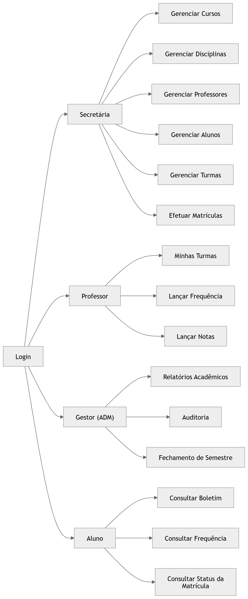
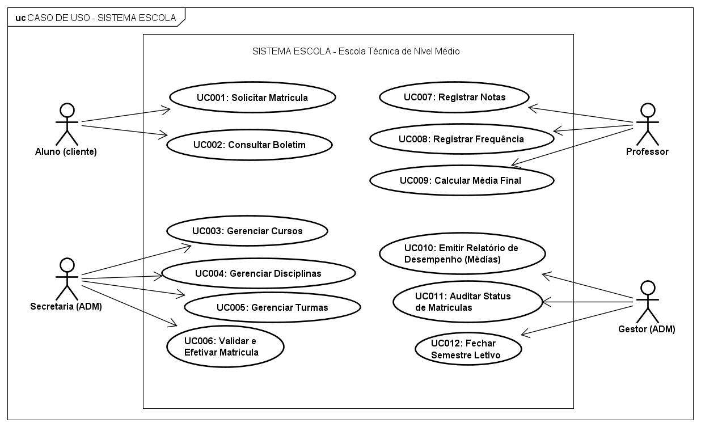
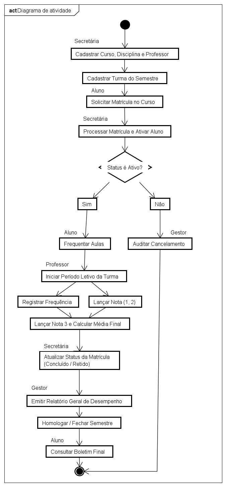
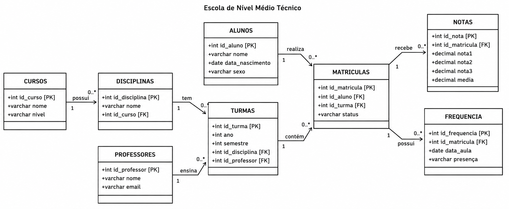
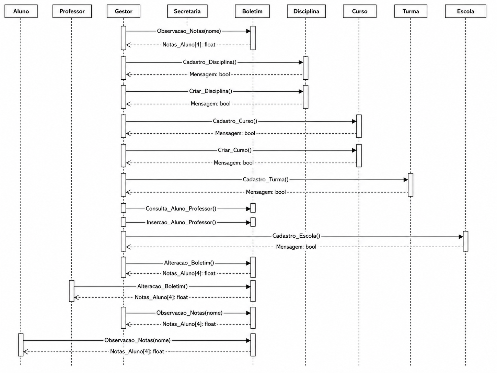
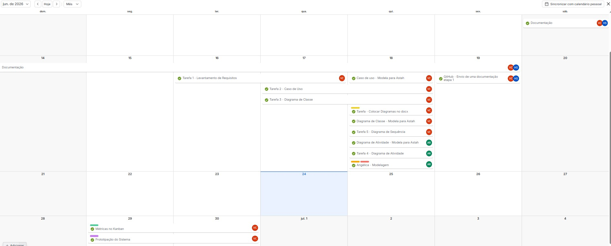
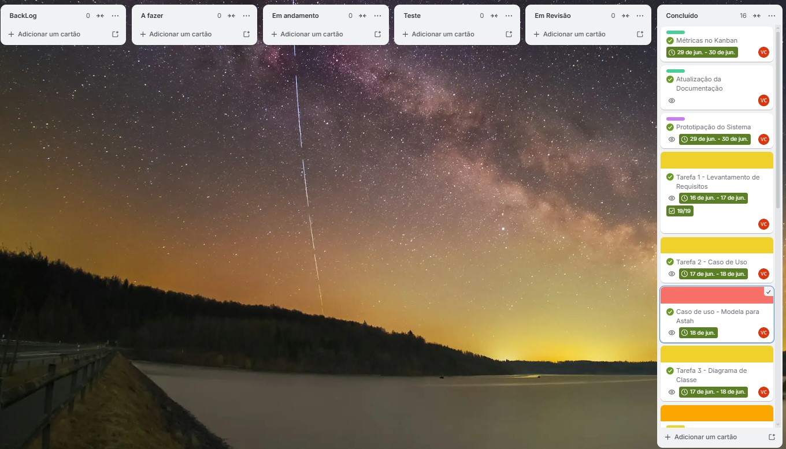
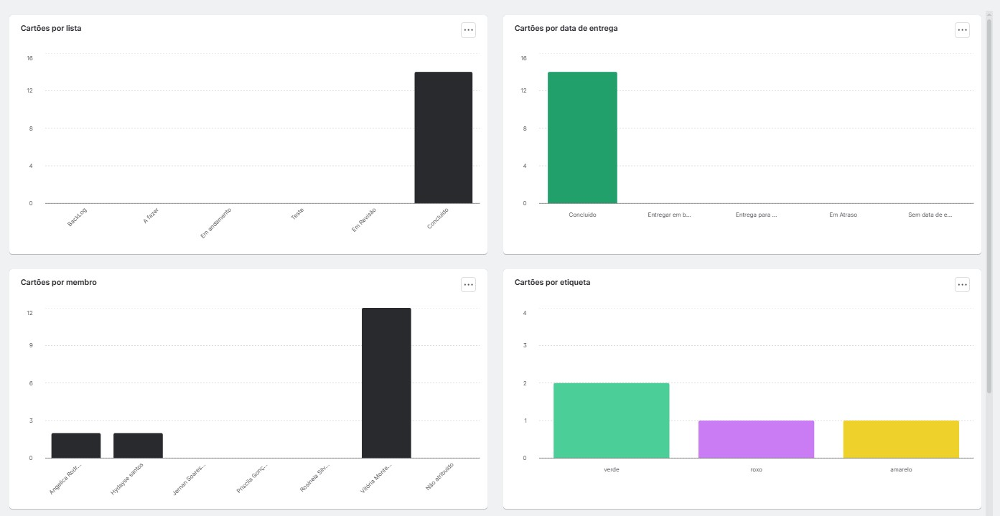

<div align="center">

# Sistema de Gestão Acadêmica
### Projeto de Sistemas – Escola Técnica de Nível Médio 

<p align="center">
  
  
  
  
  
  
  
  
</p>

</div>

> **Sobre o projeto:** Sistema de Gestão Acadêmica desenvolvido como projeto da disciplina de Gerência de Projetos, com o objetivo de especificar, modelar e documentar uma solução para gerenciamento de processos acadêmicos em uma Escola Técnica de Nível Médio.
---

## 📌 Sumário

- [Visão Geral](#-visão-geral)
- [Perfis de Usuário](#-perfis-de-usuário)
- [Principais Funcionalidades](#-principais-funcionalidades)
- [Artefatos Produzidos](#-artefatos-produzidos)
- [Diagramas e Modelagem](#-diagramas-e-modelagem)
  - [Diagrama de Navegação](#diagrama-de-navegação)
  - [Diagrama de Casos de Uso](#diagrama-de-casos-de-uso)
  - [Diagrama de Atividades](#diagrama-de-atividades)
  - [Diagrama de Classes](#diagrama-de-classes)
  - [Diagrama de Sequência](#diagrama-de-sequência)
- [Planejamento do Projeto](#-planejamento-do-projeto)
  - [Calendário de Execução](#calendário-de-execução)
  - [Quadro Kanban](#quadro-kanban)
  - [Métricas do Projeto](#métricas-do-projeto)
- [Tecnologias e Ferramentas](#-tecnologias-e-ferramentas)
- [Documentação](#-documentação)
- [Estrutura do Repositório](#-estrutura-do-repositório)
- [Resultados Obtidos](#-resultados-obtidos)
- [Evoluções Futuras](#-evoluções-futuras)
- [Equipe e Autoria](#-equipe-e-autoria)
- [Licença](#-licença)

---

## 👀 Visão Geral

O projeto contempla a análise e modelagem de um sistema capaz de controlar:

* Cursos e disciplinas;
* Professores e turmas;
* Alunos e matrículas;
* Notas e frequência;
* Relatórios acadêmicos;
* Fechamento de semestre letivo.

A proposta visa centralizar as informações acadêmicas em uma estrutura integrada, reduzindo inconsistências operacionais e proporcionando maior controle sobre os processos da instituição.

---

## 👥 Perfis de Usuário

| Perfil | Responsabilidade |
| :--- | :--- |
| **Secretária** | Cadastro e gerenciamento acadêmico |
| **Professor** | Registro de notas e frequência |
| **Gestor (ADM)** | Auditoria e relatórios gerenciais |
| **Aluno** | Consulta de boletim e situação acadêmica |

---

## 🚀 Principais Funcionalidades

* Gestão de Cursos e Disciplinas
* Gestão de Turmas
* Processamento de Matrículas
* Controle de Frequência
* Lançamento de Notas
* Cálculo Automático de Média
* Encerramento de Semestre
* Emissão de Relatórios
* Consulta ao Boletim Escolar

---

## 📑 Artefatos Produzidos

* Documento de Levantamento de Requisitos
* Regras de Negócio
* Diagrama de Casos de Uso
* Diagrama de Classes
* Diagrama de Atividades
* Diagrama de Sequência
* Diagrama de Navegação
* Modelo Relacional
* Script SQL
* Planejamento e acompanhamento utilizando Kanban

---

## 📊 Diagramas e Modelagem

### Diagrama de Navegação
Representa o fluxo de acesso às funcionalidades do sistema de acordo com cada perfil de usuário.
<div align="center">
  
</div>

### Diagrama de Casos de Uso
Apresenta as interações entre os atores e os serviços disponibilizados pelo sistema.


### Diagrama de Atividades
Descreve o fluxo operacional desde a matrícula do aluno até o encerramento do semestre letivo.
<div align="center">

</div>

### Diagrama de Classes
Modelagem estrutural das entidades do sistema e seus relacionamentos.


### Diagrama de Sequência
Representa a troca de mensagens entre os componentes do sistema durante os processos acadêmicos.


---

## 📅 Planejamento do Projeto

O gerenciamento das atividades foi realizado utilizando a metodologia ágil **Kanban** por meio da plataforma **Trello**, permitindo o acompanhamento das tarefas, métricas de progresso e cronograma das entregas.

- Link: [Trello](https://trello.com/invite/b/6a329ecce0a26f57af102ad6/ATTI550a7e8b55edf306ce9dc18f9bf7a0b94A1C4480/projeto)

### Calendário de Execução


### Quadro Kanban


### Métricas do Projeto


---

## 🛠️ Tecnologias e Ferramentas

* **Astah UML** (Modelagem dos diagramas)
* **MySQL 8** (Modelagem de Banco de Dados)
* **Trello** (Gestão do Kanban)
* **Git & GitHub** (Controle de versão e hospedagem)

---

## 📖 Documentação

A documentação completa do projeto encontra-se disponível na pasta [docs](Sistema-Gestao-Academica/docs), incluindo requisitos, diagramas UML, regras de negócio, métricas do projeto e modelagem do banco de dados.

Principais artefatos produzidos:
* Levantamento de Requisitos
* Casos de Uso
* Diagramas UML
* Regras de Negócio
* Planejamento das Atividades
* Métricas de Projeto

---

## 📂 Estrutura do Repositório

```text
Projeto_Sistemas
├── Sistema-Gestao-Academica/
│    ├──database/
│    ├──docs/
│    ├──imagens/
|
├── LICENÇA
└── README.md
```
---

## 🏆 Resultados Obtidos

O projeto permitiu aplicar conceitos de:

* Engenharia de Software
* Modelagem UML
* Análise de Requisitos
* Gerenciamento Ágil com Kanban
* Documentação Técnico

---

## 🔮 Evoluções Futuras

* Implementação da aplicação Web
* Dashboard gerencial
* Exportação de relatórios em PDF
* Controle de autenticação e autorização
* Interface responsiva para dispositivos móveis

---

## 👥 Equipe e Autoria

<table align="center">
  <tr>
     <td align="center" width="180" style="white-space: nowrap;">
      <a href="https://github.com/Vmon-teiro">
        <br />
        <sub><b>Vmon-teiro</b></sub>
      </a><br />
      👑 <i> Autora Principal </i>
    </td>
    <td>
      <ul>
        <li><b>Curso:</b> Técnico em Desenvolvimento de Sistemas</li>
        <li><b>Disciplina:</b> Gerência de Projetos</li>
        <li><b>Membros da Equipe:</b> Jernan, Angélica, Hydayse e Rosineia.</li>
      </ul>
    </td>
  </tr>
</table>

---

## 📄 Licença

> [!NOTE]
> ### 📑 Termos de Uso Acadêmico
> Este projeto foi desenvolvido **exclusivamente para fins acadêmicos e pedagógicos**. 
> Todos os direitos intelectuais, de modelagem e documentação pertencem estritamente aos seus respectivos autores. 
> 
> *Fica proibida a reprodução comercial sem autorização prévia.*
